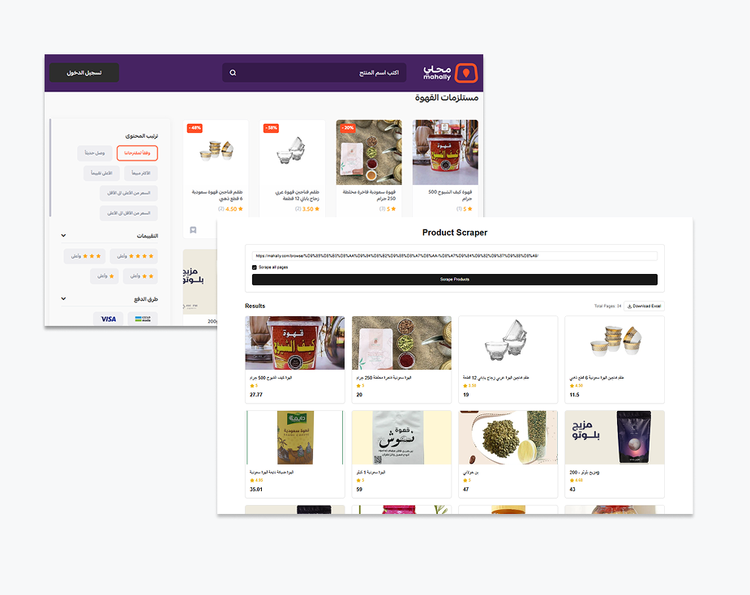

# Product Scraper - Next.js Tool for Data Extraction  

## Overview  
**Product Scraper** is a Next.js-based tool designed to extract product data from [Mahally](https://mahally.com/browse/%D9%85%D8%B3%D8%AA%D9%84%D8%B2%D9%85%D8%A7%D8%AA-%D9%84%D9%82%D9%87%D9%88%D8%A9/).  
It efficiently scrapes product details, including names, prices, images, and descriptions, to facilitate data collection for e-commerce analysis and automation.  

## Features  
- ✅ **Fast and efficient web scraping** using Puppeteer or Cheerio  
- ✅ **Extracts product names, prices, images, and URLs**  
- ✅ **Built with Next.js** for performance and scalability  
- ✅ **Supports Arabic content extraction**  
- ✅ **Optimized for structured and clean data output**  

## Use Cases  
- 📊 **Market research and price comparison**  
- 🛒 **Automating product data collection**  
- 🔄 **E-commerce data migration and analysis**  

Would you like to add specific functionalities like pagination handling or data export options? 🚀  
